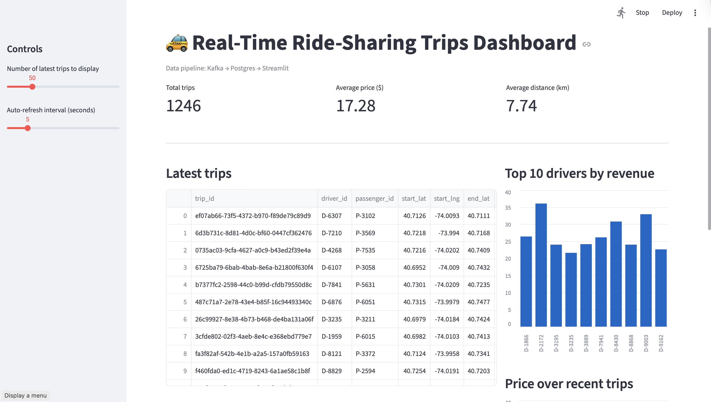

# Real-Time Ride-Sharing Streaming System

This project implements a real-time data streaming pipeline using **Apache Kafka**, **PostgreSQL**, and **Streamlit**.

The original assignment provided a reference e-commerce streaming pipeline.  
In this project, I **change the data domain to ride-sharing trips** and build an end-to-end system:

- Synthetic ride-sharing trip events are generated in Python
- Events are streamed through Kafka
- A Kafka consumer stores the events into PostgreSQL
- A Streamlit dashboard displays a live, auto-refreshing view of the latest trips and summary metrics

---

## 1. Architecture Overview

**Data domain:** Ride-sharing trips (e.g., Uber/Lyft-style trips).

**Pipeline:**

1. **Producer (`producer.py`)**
   - Generates synthetic trip events (driver, passenger, locations, distance, price, timestamp).
   - Sends them to a Kafka topic named `trips`.

2. **Kafka (via Docker)**
   - Zookeeper + Kafka broker run in Docker containers.
   - Kafka topic: `trips`.

3. **Consumer (`consumer.py`)**
   - Subscribes to the `trips` topic.
   - Deserializes JSON messages.
   - Inserts each event into a PostgreSQL table `trips`.

4. **Database (PostgreSQL)**
   - Runs in a Docker container.
   - Stores all trip records in a table `trips`.

5. **Dashboard (`dashboard.py`)**
   - Streamlit app that connects to PostgreSQL.
   - Periodically queries the latest trips and summary metrics.
   - Displays a live dashboard with auto-refresh.

## 2. Technology Stack

Python 3

Kafka (Docker, wurstmeister/kafka image)

Zookeeper (Docker)

PostgreSQL 14 (Docker)

Streamlit (web UI)

Python libraries:

- kafka-python

- psycopg2-binary

- pandas

- streamlit

## 3. Setup Instructions

### 3.1 **Clone the repository**

```bash
git clone <your-repo-url>.git
cd realtime-streaming
```

### 3.2 **Create and activate a virtual environment**

```bash
python3 -m venv venv
source venv/bin/activate   
```

### 3.3 **Install Python dependencies**

```bash
pip install -r requirements.txt
```

### 3.4 **Start Docker services (Kafka + Postgres)**

Ensure **Docker Desktop** is running, then from the project root:

```bash
docker compose up -d
# or: docker-compose up -d
```

This will start:

- `realtime-streaming-zookeeper-1`
- `realtime-streaming-kafka-1`
- `realtime-streaming-postgres-1`

---

## 4. Kafka and Database Configuration

### 4.1 **Kafka topic `trips`**

Create the Kafka topic (using the **wurstmeister/kafka** image layout):

```bash
docker exec -it realtime-streaming-kafka-1 /opt/kafka/bin/kafka-topics.sh \
  --create \
  --topic trips \
  --bootstrap-server localhost:9092 \
  --partitions 1 \
  --replication-factor 1
```

**Verify:**

```bash
docker exec -it realtime-streaming-kafka-1 /opt/kafka/bin/kafka-topics.sh \
  --list \
  --bootstrap-server localhost:9092
```

You should see:

```text
trips
```

### 4.2 **PostgreSQL table**

Enter the Postgres container:

```bash
docker exec -it realtime-streaming-postgres-1 psql -U kafka_user -d kafka_db
```

Create the `trips` table:

```sql
CREATE TABLE trips (
    trip_id TEXT PRIMARY KEY,
    driver_id TEXT,
    passenger_id TEXT,
    start_lat DOUBLE PRECISION,
    start_lng DOUBLE PRECISION,
    end_lat DOUBLE PRECISION,
    end_lng DOUBLE PRECISION,
    distance_km DOUBLE PRECISION,
    price_usd DOUBLE PRECISION,
    ts TIMESTAMP
);
```

You can verify with:

```sql
\dt
SELECT * FROM trips LIMIT 5;
\q
```

---

## 5. Components

### 5.1 **Producer (`producer.py`)**

Generates a **synthetic ride-sharing trip every second**.

**Example event fields:**

- `trip_id` (UUID)  
- `driver_id`, `passenger_id`  
- `start_lat`, `start_lng`, `end_lat`, `end_lng`  
- `distance_km`, `price_usd`  
- `ts` (ISO timestamp)

Sends each event as JSON to the Kafka topic **`trips`**.

**Run:**

```bash
source venv/bin/activate
python3 producer.py
```

---

### 5.2 **Consumer (`consumer.py`)**

- Subscribes to the Kafka topic **`trips`**  
- Deserializes each JSON message  
- Inserts into the Postgres **`trips`** table  

**Run (in a separate terminal, with venv activated):**

```bash
source venv/bin/activate
python3 consumer.py
```

You should see log messages like:

```text
Inserted trip <trip_id> into Postgres.
```

You can also check counts directly in Postgres:

```bash
docker exec -it realtime-streaming-postgres-1 psql -U kafka_user -d kafka_db
```

```sql
SELECT COUNT(*) FROM trips;
\q
```

---

### 5.3 **Dashboard (`dashboard.py`)**

Connects to **PostgreSQL** and reads:

- Latest **N trips** (configurable in the sidebar)  
- Aggregated metrics: **total trip count**, **average price**, **average distance**

Displays:

- **KPI cards** (total trips, average price, average distance)  
- **Table** of the latest trips  
- **Bar chart**: top 10 drivers by total revenue  
- **Line chart**: price over recent trips  

Auto-refreshes every **X seconds** (also configurable in the sidebar).

**Run:**

```bash
source venv/bin/activate
streamlit run dashboard.py
```

Open the URL shown in the terminal (usually **http://localhost:8501**).

---

## 6. How to Run the Full Pipeline

1. **Start Docker services (once):**

   ```bash
   docker compose up -d
   ```

2. **Create Kafka topic and Postgres table (first time only).**

3. **Run producer (Terminal 1):**

   ```bash
   source venv/bin/activate
   python3 producer.py
   ```

4. **Run consumer (Terminal 2):**

   ```bash
   source venv/bin/activate
   python3 consumer.py
   ```

5. **Run Streamlit dashboard (Terminal 3):**

   ```bash
   source venv/bin/activate
   streamlit run dashboard.py
   ```

6. Open the dashboard in the browser and **watch metrics update in real time** as new trips are produced and consumed.

## 7. Screenshots

### Screenshots of dashboard



### The video of realtime update is in the repository
